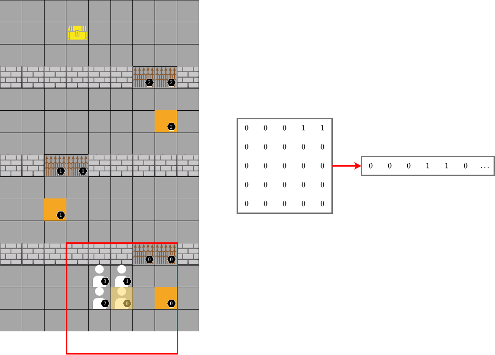

# PressurePlate


[](https://GitHub.com/Naereen/StrapDown.js/graphs/commit-activity)
[](https://github.com/Naereen/StrapDown.js/blob/master/LICENSE)

<p align="center">
 
</p>


# Description
Pressure Plate is a multi-agent environment that requires agents to cooperate during the traveral of a gridworld.
The grid is partitioned into several rooms. Within each room is a plate and a closed doorway. In order to open the door
into the next room, an agent needs to remain standing within the gridcell that contains the plate. 

Currently, Pressure Plate supports four-, five-, and six-player linear levels, but is easily configurable for
custom scenarios. See [Customizing Scenarios](#customizing-scenarios) for more information.

## Observation Space
Each agent has a distance-limited view of the environment, as defined by the ``sensor_range`` attribute of the ``PressurePlate``
class. The PressurePlate world is made of several 2D grids, where each grid corresponds to an entity type. For example,
one grid corresponds to walls, one grid corresponds to plates, and so on. When queried, the environment produces a subsection 
of each grid that corresponds to each agent's viewing range. These subsections are flattened and concatenated together.
Finally, the agent's ``(x,y)`` coordinates are concatenated to the end of the observation vector.

See the below figure for a depiction of this process.
<p align="center">
 
</p>

## Action Space
Pressure Plate's action space is discrete and has five options: up, down, left, right, and no-op (do nothing).

## Reward Function
Each agent receives rewards independent of other agents. If an agent is in the room that contains their assigned plate,
their reward is the normalized manhattan distance between their current position and the plate. Otherwise, their reward is 
the number of rooms between their current room and the room that contains their assigned plate.

# Installation
After cloning the repo, ```cd``` into ```pressureplate``` and:
```cli
pip install -e .
```

# Using Pressure Plate
Within your Python script, access the three currently-available tasks as follows:
```python
env = gym.make('pressureplate-linear-4p-v0')
env = gym.make('pressureplate-linear-5p-v0')
env = gym.make('pressureplate-linear-6p-v0')
```

The PressurePlate environment is implemented within the Gym paradigm, and therefore uses the usual ``.step()``, 
``.reset()``, and ``.render()`` methods.
## Customizing Scenarios
To create a custom Pressure Plate layout, you can add a layout dictionary to the ```pressureplate/assets.py``` file. 
The dictionary must contain lists of ```(x,y)``` coordinates of the following elements:
* A unique identifier (e.g., ```'FOUR_PLAYERS'```)
* ```'WALLS'```
* ```'DOORS'```
* ```'PLATES'```
* ```'AGENTS'```
* ```'GOAL'```

Additionally, you will need to register the new task as a gym environment within ```pressureplate/__init__.py```. 
Finally, edit the ```PressurePlate``` class with ```pressureplate/environment.py``` to load your custom layout into the
```self.layout``` attribute.

For detailed instructions, please refer to the docstring within ```pressureplate/assets.py```.

# Citation


